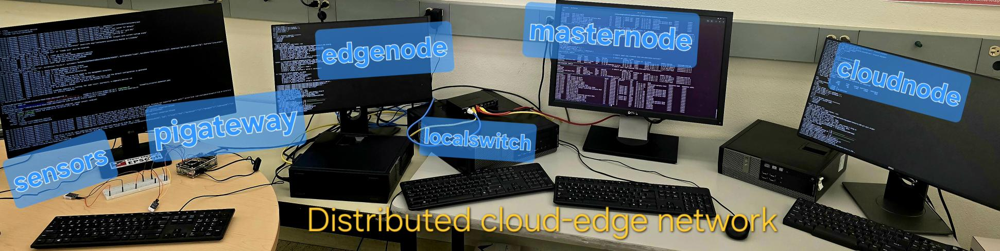
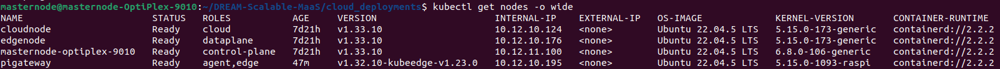
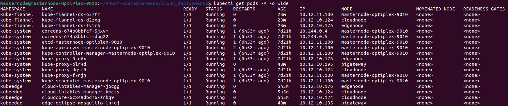

### Scalable DIAM Network Architecture for Multi-Site MaaS between UNM, NMSU, NMT, and NTU

This repository implements a scalable cloud-edge network architecture for Distributed Intelligent Additive Manufacturing (DIAM) and multi-site Manufacturing-as-a-Service (MaaS). It supports remote job submission, policy-aware service selection, telemetry-driven orchestration, and edge-side enforcement across geographically distributed manufacturing sites.

This repo is dedicated to:

* Implementing a multi-site MaaS workflow where a remote client submits a print order to the CloudNode, and the cloud orchestration layer selects the most appropriate site and printer based on policy, SLA, and system conditions.
* Defining the CloudNode application and control-plane microservices, including the Web Order App, Marketplace, Job Manager, Policy Management System, SLA Intelligence, and SDN Controller.
* Establishing a closed-loop orchestration framework in which telemetry from the edge is continuously streamed back to the cloud for monitoring, re-scoring, and dynamic decision-making.
* Integrating an edge-side Security Enforcement Agent that applies cloud-defined ACL and QoS policies to protect and segment manufacturing traffic.
* Extending the architecture with Kubernetes and KubeEdge to support cloud-edge orchestration across standard cluster nodes and remote edge gateways.
* Supporting SDN-based edge networking using ONOS and Open vSwitch (OVS), with KubeEdge-enabled edge expansion for device-side integration and future sensor-driven telemetry workflows.

## Current deployment status

The current testbed has been successfully deployed with the following nodes:

* **masternode** – Kubernetes control-plane node
* **cloudnode** – cloud worker node hosting CloudCore and cloud-side services
* **edgenode** – edge/data-plane worker node for SDN and edge-side enforcement functions
* **pigateway** – Raspberry Pi gateway connected through KubeEdge EdgeCore

The currently running environment includes:

* A healthy Kubernetes cluster
* KubeEdge successfully deployed with:
  * **CloudCore** running on `cloudnode`
  * **EdgeCore** running on `pigateway`
* Flannel excluded from `pigateway` to avoid conflict with the edge-specific setup
* Cloud-side and edge-side KubeEdge components successfully registered and running

## Start setup

### 1. Deploy the Kubernetes cluster for network orchestration

Follow the README in this directory:

```bash
/kubernetes-deployment/README.md
```

---

<!--  -->

---

<!--  -->

---

<!--  -->

---

<!--  -->
